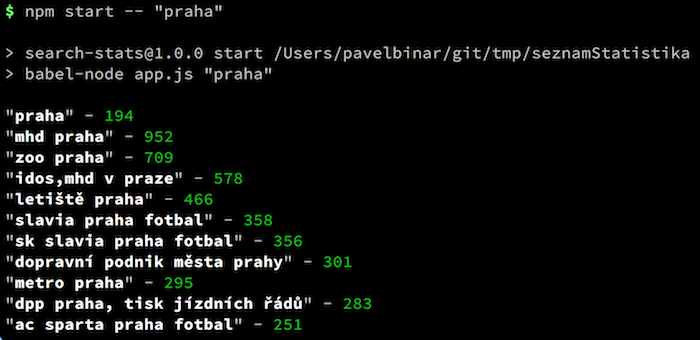

# Seznam Statistika

> CLI app for [seznam.cz](http://search.seznam.cz/) search statistics

## Dependencies

- [Node.js](http://nodejs.org) `v6.10.3`
- [Yarn](https://yarnpkg.com) `0.27.5`

## Installation

    git clone git@github.com:pavelbinar/seznamStatistika.git
    cd seznamStatistika
    yarn

## Run App

	npm start -- “<search term>”

### Example

	npm start -- “praha”