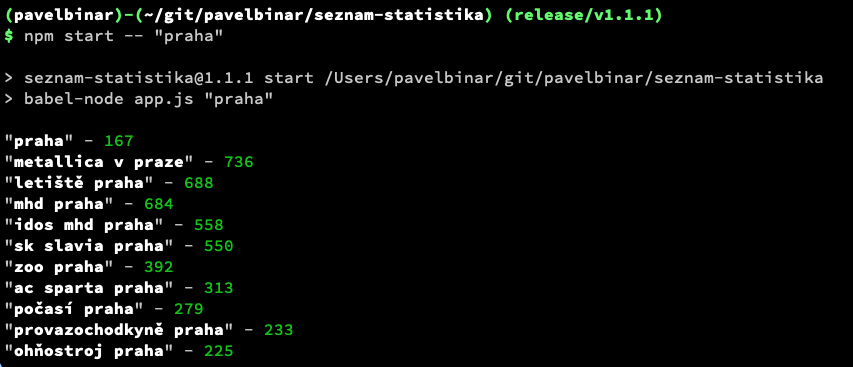

# Seznam Statistika `1.1.1`

> CLI app for [seznam.cz](http://search.seznam.cz/) search statistics

## Dependencies

* [Node.js](http://nodejs.org) `v10.16.1`

## Installation

    git clone git@github.com:pavelbinar/seznam-statistika.git
    cd seznam-statistika
    npm install

## Run App

    npm start -- "<search term>"

### Example

    npm start -- "praha"
